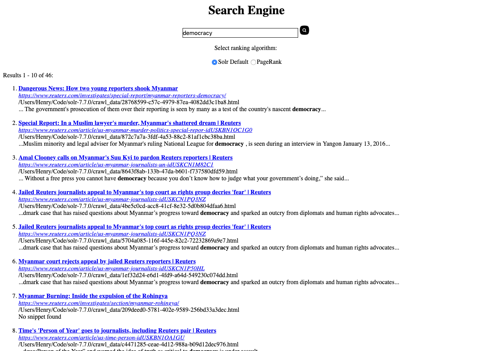

# Search Engine
A mini search engine based on Apache Solr.

You can set up a personal search engine follow the instructions.

## Features

Spell Correction


---

AutoComplete


---

Two ranking algorithms



## Download

```shell
$ git clone https://github.com/HER0MA/SolrSearchEngine.git
```

## Components

- **index.php** is the front end code
- **OutlinkExtractor** and **pagerank.py** are programs for genertating pagerank scores
- **Parse.java** is the programs for generating spell correction data

## Set Up Instruction

1. Download and install **Apache Solr**. [installation tutorial](<http://lucene.apache.org/solr/guide/7_7/solr-tutorial.html>)

2. Start Solr using command ```bin/solr start```. Then create a new core named as myexample using command ```$ bin/solr create –c myexample```.

3. Crawl pages from the website you want to search with [crawler4j](https://github.com/yasserg/crawler4j/releases). Put generated cvs file into apache root directory. Put all the crawled html webpages from Crawler4j into solr folder, under the folder named **crawl_data**.

4. Index html files with **TIKA** (library used for document type detection and content extraction from various file formats, included with the Solr installation). Command: ```$ bin/post –c myexample -filetypes html crawl_data/```

5. Open the Solr UI and check if the filed get indexed. Open [Solr management page](http://localhost:8983/solr/), select the core "myexample" and see the statics.

6. Run the java program in **OutlinkExtractor** folder to generate **edgelist.txt**. Modify the path in CreateEdgeList class before run.

  ```java
  private final static String dirPath = "~/solr/crawl_data";
  private final static String edgeListPath = "./Edgelist.txt";
  private final static String mapFilePath = "./map.csv";
  ```

7. Run the **pagerank.py** program to generate **external_pageRankFile.txt**. This program requires edgelist.txt. Modify the path before run. You should have [networkX](https://networkx.github.io/documentation/networkx-1.10/download.html) installed in your computer.

  ```python
  base = "~/solr/crawl_data/"
  target = "./external_pageRankFile.txt"
  edgelistPath="./Edgelist.txt"
  ```

8. Place external_pageRankFile.txt in ***solr/server/solr/myexample/data*** folder inside the core folder. This file provides data of **pagerank scores**.

9. Run **Parse.java** to generate **big.txt**. Modify path before running. Put big.txt into apache server root directory. This file provides data for **spell correction**.

  ```java
  String html_dir_path= "~/solr/crawl_data/";
  ```

10. Modify solr/server/solr/myexample/conf/**managed-schema**, add following components:

  ```xml
  <fieldType name="external" keyField="id" defVal="0" class="solr.ExternalFileField" valType="float"/>
  <field name="pageRankFile" type="external" stored="false" indexed="false"/>
  ```

11. Modify solr/server/solr/myexample/conf/**solrconfig.xml**,add following components:

   ```xml
   <listener event="newSearcher" class="org.apache.solr.schema.ExternalFileFieldReloader"/>
   <listener event="firstSearcher" class="org.apache.solr.schema.ExternalFileFieldReloader"/>
   
   <searchComponent class="solr.SuggestComponent" name="suggest" >
     <lst name="suggester">
       <str name="name">suggest</str>
       <str name="lookupImpl">FuzzyLookupFactory</str>
       <str name="field">_text_</str>
       <str name="suggestAnalyzerFieldType">string</str>
     </lst>
   </searchComponent>
   
   <requestHandler name="/suggest" class="solr.SearchHandler">
       <lst name="defaults">
         <str name="suggest">true</str>
         <str name="suggest.count">5</str>
         <str name="suggest.dictionary">suggest</str>
       </lst>
       <arr name="components">
         <str>suggest</str>
       </arr>
     </requestHandler>
   ```

12. Put index.php into apache server root directory.

13. Download [SpellCorrector.php](https://sourceforge.net/projects/simplehtmldom/postdownload) and put it into apache server root directory.

14. Download [simple_html_dom.php](<https://sourceforge.net/projects/simplehtmldom/>) and put it into apache server root directory.

15. Download [solr-php-client](https://github.com/PTCInc/solr-php-client) and put it into apache root.

16. Start apache server, open browser and go to your local host page. Try to search something.
